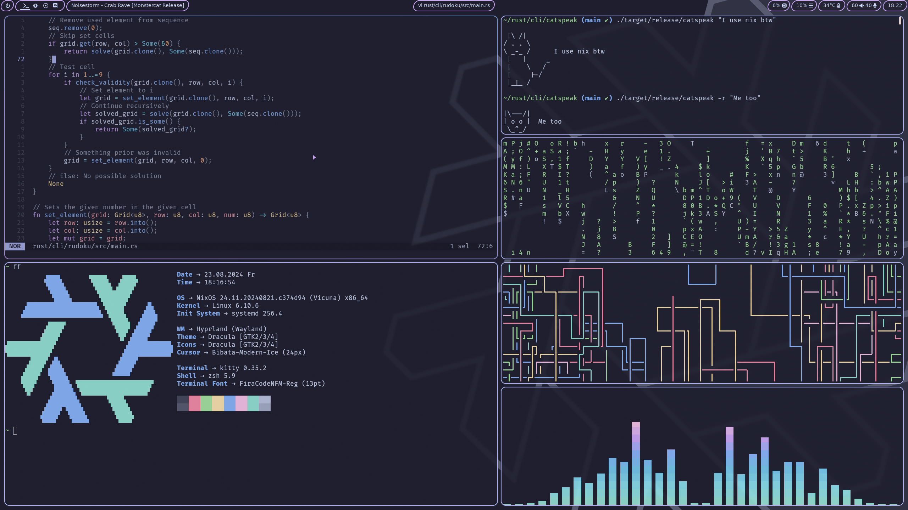

# nix-config
My Nix configs

## Configuration
```
Window Manager       - Hyprland
Terminal             - Kitty
Browser              - Firefox
Explorer             - Nemo
Application Launcher - Fuzzel
Bar                  - Waybar
Audio                - Pipewire
Boot Manager         - Grub
Editor               - Helix
Theme                - Catppuccin Mocha Mauve
```

### Preview

[Wallpaper](https://wallhaven.cc/w/2yx5og)

## Apply
### Before
- Download the minimal NixOS [ISO image](https://nixos.org/download) (NixOS -> ISO image -> Minimal ISO image -> Download (64-bit Intel/AMD)
- Flash this ISO image onto a USB flash drive (via: cp / dd / balena-etcher)
- Boot from your bootable USB flash drive
- Choose the standard live option

### After
- Check if you didn't make any mistakes and didn't get any errors
- Exit nix-shell with ```exit```
- Reboot to your system with ```reboot```
- Remove your USB flash drive at reboot
- Login with default password: 1234

### Install
- Create the necessary directories with ```sudo mkdir -p /mnt/etc```
- Start ```sudo nix-shell -p git``` to be able to use git
- Get these config files with ```git clone https://github.com/SchweGELBin/nix-config --depth 1 /mnt/etc/nixos```

<br>

- Install NixOS with ```nixos-install --root /mnt --flake /mnt/etc/nixos#default```
- (If you get an out of space error, rerun last command)
- Type in your preferred root password (twice)

## Tips
- To sync the config with a newer version run ```sudo git fetch && sudo git pull``` inside of /etc/nixos
- Feel free to contribute to make these configs better
- Run ```sudo rebuild``` to rebuild the system
- You may want to edit your password
- View the keybinds with "SUPER"

## Credits
- Thank you ```vimjoyer``` for your help! | [GitHub](https://github.com/vimjoyer) - [Youtube](https://youtube.com/@vimjoyer)
