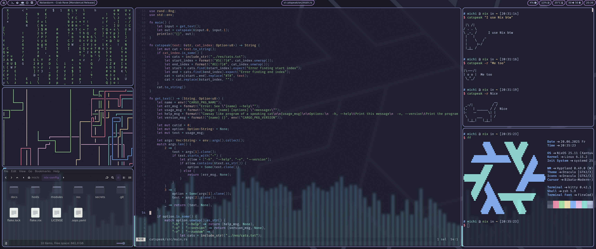

# nix-config
My Nix configs

## Configuration
```
Window Manager       - Hyprland
Terminal             - Kitty
Browser              - Firefox
Explorer             - Nemo
Application Launcher - Fuzzel
Bar                  - Waybar
Audio                - Pipewire
Boot Manager         - Grub
Editor               - Helix
Theme                - Catppuccin Mocha Mauve
```

### Preview


## [Apply](./Install.md)

## Tips

### Keybinds
- View the keybinds with *"SUPER + MENU"*

### Scripts
General
```
$ bluetooth-toggle            | Toggle Bluetooth Power
# config-reset [git/https/*]  | Reset config
$ loopback                    | Toggle mic loopback
$ music                       | Toogle music-instance
$ music-instance              | Play music
# rebuild [$option] [$host]   | Rebuild system
$ update                      | Update config
$ userjs2nix [arkenfox/.../*] | Echo user.js in nix format
$ vpn [on/off/*]              | Toggle VPN connection
```
Hyprland
```
$ avabg [c/gl/*] [t]      | Start [c/gl/*]avabg-instance or [t]oggle it
$ avabg-instance [c/gl/*] | Start [c/gl/*]ava background instance
$ binds                   | Show Keybinds
$ glavabg-setup [f]       | Replace glava config
$ screenshot [d/w/r/h]    | Take screenshot ([d]isplay/[w]indow/[r]egion/[h]elp)
```
